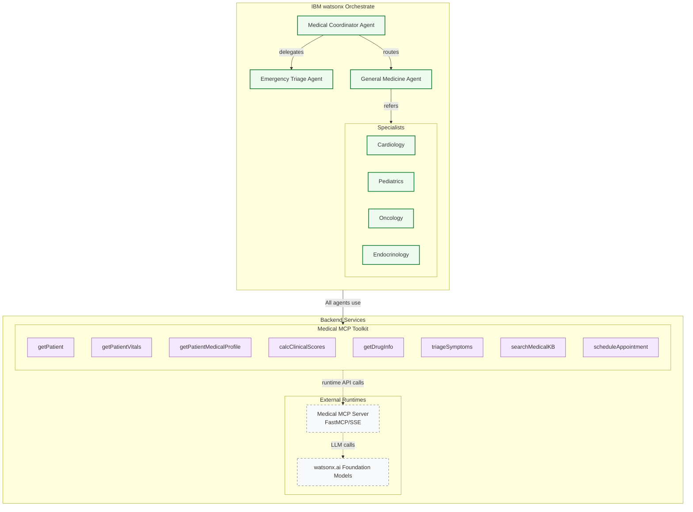

# medical-mcp-toolkit

Production-ready **MCP-style** server that exposes clinical tools for **IBM watsonx Orchestrate** agents.

<p align="left">
  
  
  
  
  <a href="https://github.com/ruslanmv/medical-mcp-toolkit"></a>
</p>

> **What it is:** a clean MCP server exposing **12 medical tools** via both:
>
> * An **HTTP API** (FastAPI) for quick testing & service integration.
> * **MCP transports** (SSE/STDIO) for LLM multi-agent orchestration.

---

## ✨ Features

* **12 tools**: patient, vitals, profile, clinical calculators, drug info / interactions / contraindications / alternatives, symptom triage, KB search, scheduling, patient 360.
* **FastAPI HTTP endpoints**: `/health`, `/schema`, `/tools`, `/invoke`.
* **Bearer token authentication** (set `BEARER_TOKEN`).
* **uv-managed** Python environment (`uv sync`, `.venv`).
* **Containerized** (Dockerfile). Structured logs to stdout.
* **Postman** collection for one-click testing.
* **Mermaid architecture** (kept exactly as provided below).

---

## 🧠 System Context



**Companion Multi-Agent Repository (Orchestrate):** [https://github.com/ruslanmv/Medical-AI-Assistant-System](https://github.com/ruslanmv/Medical-AI-Assistant-System)
**This repo:** [https://github.com/ruslanmv/medical-mcp-toolkit](https://github.com/ruslanmv/medical-mcp-toolkit)

---

## 🚀 Quickstart (uv)

```bash
# 1) Clone and enter the repo
git clone https://github.com/ruslanmv/medical-mcp-toolkit
cd medical-mcp-toolkit

# 2) Create venv and install deps (uv-managed)
make install   # or: make uv-install

# 3) Run the HTTP server (FastAPI on port 9090)
export BEARER_TOKEN=dev-token
uv run uvicorn server:app --host 0.0.0.0 --port 9090
```

Typical startup log (example):

```
2025-10-15 12:16:46,272 INFO [mcp_server] [registry] 12 tools registered: calcClinicalScores, getDrugAlternatives, getDrugContraindications, getDrugInfo, getDrugInteractions, getPatient, getPatient360, getPatientMedicalProfile, getPatientVitals, scheduleAppointment, searchMedicalKB, triageSymptoms
INFO:     Started server process [23217]
INFO:     Waiting for application startup.
INFO:     Application startup complete.
INFO:     Uvicorn running on http://0.0.0.0:9090 (Press CTRL+C to quit)
```

---

## ✅ Smoke Test (bash)

Health is **plain text** (`ok`), so use `jq -R .`:

```bash
curl -sS http://localhost:9090/health | jq -R .
# "ok"
```

Invoke a tool:

```bash
curl -sS -X POST "http://localhost:9090/invoke" \
  -H 'Authorization: Bearer dev-token' \
  -H 'Content-Type: application/json' \
  -d '{
    "tool": "triageSymptoms",
    "args": {
      "age": 45,
      "sex": "male",
      "symptoms": ["chest pain","sweating"],
      "duration_text": "2 hours"
    }
  }' | jq
```

Example result:

```json
{
  "ok": true,
  "tool": "triageSymptoms",
  "result": {
    "acuity": "urgent",
    "advice": "call emergency services",
    "rulesMatched": ["chest pain", "diaphoresis"],
    "nextSteps": ["ECG", "troponin", "aspirin if not contraindicated"]
  }
}
```

> If you see `jq` parse errors, you’re probably piping non-JSON. `/health` is text/plain; `/invoke` is JSON. Add `-i` to `curl` to review HTTP status/headers.

---

## 🔌 HTTP API

* `GET /health` → **ok** (text/plain)

  * JSON-view trick: `curl -sS /health | jq -R -r .` → `ok`
* `GET /schema` (auth) → Components JSON Schema (from `schemas/components.schema.json`)
* `GET /tools` (auth) → `{"tools": ["..."]}`
* `POST /invoke` (auth) → `{"ok": true, "tool": "<name>", "result": ...}`

**Auth:** set `BEARER_TOKEN` in the server environment. If unset, auth is disabled (dev mode).
Send: `Authorization: Bearer <token>` for `/schema`, `/tools`, `/invoke`.

---

## 🧰 Available Tools (12)

* Patient: `getPatient`, `getPatientVitals`, `getPatientMedicalProfile`
* Calculators: `calcClinicalScores` (BMI, BSA, CrCl, eGFR)
* Drugs: `getDrugInfo`, `getDrugInteractions`, `getDrugContraindications`, `getDrugAlternatives`
* Triage & KB: `triageSymptoms`, `searchMedicalKB`
* Scheduling & P360: `scheduleAppointment`, `getPatient360`

Use `GET /tools` to list names, and `GET /schema` for typed input/output.

---

## 🧪 More Examples

List tools:

```bash
curl -sS "http://localhost:9090/tools" \
  -H 'Authorization: Bearer dev-token' | jq
```

Get schema:

```bash
curl -sS "http://localhost:9090/schema" \
  -H 'Authorization: Bearer dev-token' | jq
```

Drug info:

```bash
curl -sS -X POST "http://localhost:9090/invoke" \
  -H 'Authorization: Bearer dev-token' \
  -H 'Content-Type: application/json' \
  -d '{"tool":"getDrugInfo","args":{"drug":"lisinopril"}}' | jq
```

---

## 🧵 MCP Transports (SSE / STDIO)

The same tools are exposed via MCP for LLM agents.

**SSE transport (port 9090):**

```bash
uv run python -c "import asyncio; \
from medical_mcp_toolkit.mcp_server import run_mcp_async; \
asyncio.run(run_mcp_async('sse', host='0.0.0.0', port=9090))"
```

**STDIO transport:**

```bash
uv run python -c "import asyncio; \
from medical_mcp_toolkit.mcp_server import run_mcp_async; \
asyncio.run(run_mcp_async('stdio'))"
```

> Note: The **HTTP API** is served by `uvicorn server:app`. The **SSE/STDIO** MCP runner is separate (from `mcp_server.py`). Choose the mode you need.

---

## 🛠️ Development

**Environment (uv-managed):**

```bash
make install       # or: make uv-install
make fmt           # ruff format + black
make lint          # ruff check
make test          # pytest
```

**Run HTTP API (dev):**

```bash
export BEARER_TOKEN=dev-token
uv run uvicorn server:app --host 0.0.0.0 --port 9090
```

**Run MCP SSE (dev):**

```bash
uv run python -c "import asyncio; from medical_mcp_toolkit.mcp_server import run_mcp_async; asyncio.run(run_mcp_async('sse', host='0.0.0.0', port=9090))"
```

---

## 🐳 Docker

Build & run:

```bash
make docker-build
BEARER_TOKEN=prod-secret make docker-run
# Server will listen on container port 9090 and be mapped to localhost:9090
```

Logs & stop:

```bash
make docker-logs
make docker-stop
```

---

## ⚙️ Configuration (env)

* `BEARER_TOKEN` — required for auth in non-dev environments.
* `MCP_LOG_LEVEL` — log level for MCP parts (`INFO`, `DEBUG`, …).
* `UVICORN_LOG_LEVEL` — log level for Uvicorn (`info`, `debug`, …).
* (Adapters, when you wire real systems)

  * `DRUG_API_BASE`, `DRUG_API_KEY`
  * `KB_BASE`
  * `SCHED_BASE`

---

## 📬 Postman

Import `postman/medical-mcp-toolkit.postman_collection.json`.
Set variables:

* `baseUrl` → `http://localhost:9090`
* `token` → your bearer token (e.g., `dev-token`)

---

## 🧩 What You Can Do With This Repo

* **Plug-and-play medical tools** for multi-agent systems (watsonx Orchestrate, etc.).
* **Call tools over HTTP** for rapid prototyping, dashboards, or RPA glue.
* **Run MCP transports** so LLM agents can invoke the same functions natively.
* **Swap demo adapters** with real EHR/Drug-DB/KB/Scheduling systems while keeping typed contracts (Pydantic models + JSON Schema).
* **Ship to prod** with Docker and lightweight operational footprint.

---

## 🧯 Troubleshooting

* `jq: parse error ...` on `/health`: that route returns **text/plain**. Use:

  ```bash
  curl -sS http://localhost:9090/health | jq -R -r .
  ```
* `401 Unauthorized` on `/invoke`: start the server with `BEARER_TOKEN` and pass the same in `Authorization: Bearer ...`.
* You started the **SSE MCP runner** but are calling HTTP endpoints: SSE mode doesn’t serve `/invoke`. Use `uvicorn server:app` for the HTTP API.
* Check port binding:

  ```bash
  ss -ltnp | grep 9090   # or: sudo lsof -i :9090
  ```

---

## 📜 License

MIT — see `LICENSE`.

---

## 🤝 Acknowledgments

Built with ❤️ for clinical AI prototyping at production quality.
Optimized for **IBM watsonx Orchestrate** multi-agent systems and compatible LLM runtimes.