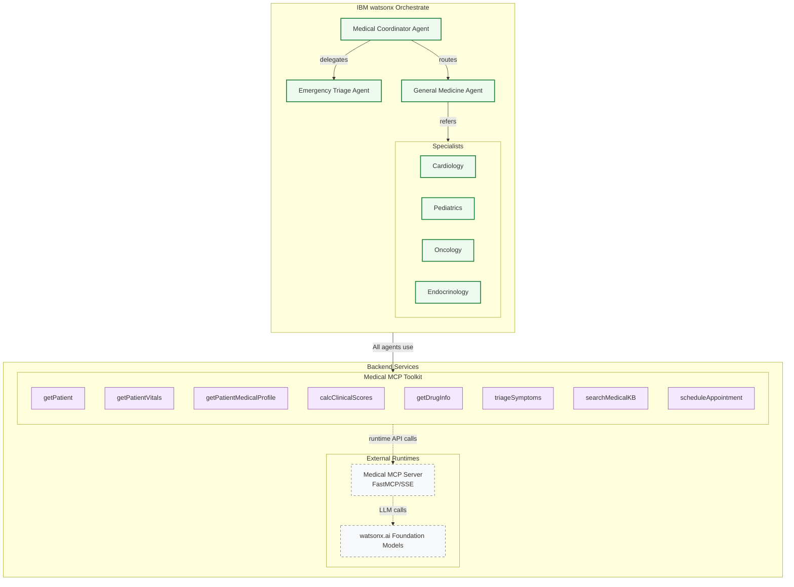

# medical-mcp-toolkit

Production-ready MCP-style server that exposes clinical tools for IBM watsonx Orchestrate agents.

## Features
- 12 tools: patient, vitals, profile, clinical calculators, drug info/interactions/contraindications/alternatives, symptom triage, KB search, scheduling, patient 360.
- FastAPI HTTP endpoints: `/health`, `/schema`, `/tools`, `/invoke`.
- Bearer token authentication (set `BEARER_TOKEN`).
- Thin adapters with retries and timeouts (`httpx` + `tenacity`).
- Containerized (Dockerfile). Structured logs to stdout.

## System Context



**Companion Multi‑Agent Repository (Orchestrate):**
<https://github.com/ruslanmv/Medical-AI-Assistant-System>

## Quickstart (with uv)
```bash
# 1) Clone and enter the repo
cd medical-mcp-toolkit

# 2) Create venv and install deps
make install

# 3) Run the server (dev)
BEARER_TOKEN=dev-token make run
# Server on http://localhost:8080
```

## API
- `GET /health` → `ok`
- `GET /schema` (auth) → Shared JSON Schema (`schemas/components.schema.json`)
- `GET /tools` (auth) → List of registered tools
- `POST /invoke` (auth) → Invoke any tool

### Invoke example
```bash
curl -s -X POST "http://localhost:8080/invoke" \
  -H "Authorization: Bearer dev-token" \
  -H "Content-Type: application/json" \
  -d '{
    "tool": "triageSymptoms",
    "args": {
      "age": 45,
      "sex": "male",
      "symptoms": ["chest pain", "sweating"],
      "duration_text": "2 hours"
    }
  }' | jq
```

## Docker
```bash
make docker-build
BEARER_TOKEN=prod-secret make docker-run
```

## Configuration (env vars)
- `BEARER_TOKEN` — required for auth in non-dev environments
- `DRUG_API_BASE`, `DRUG_API_KEY` — drug DB adapter
- `KB_BASE` — knowledge base adapter
- `SCHED_BASE` — scheduling adapter
- `PORT`, `HOST` — server binding

## Postman Collection
A ready-to-import collection is provided in `postman/medical-mcp-toolkit.postman_collection.json` with variables `baseUrl` and `token`.

## Smoke Test
Run a full tool sweep locally:
```bash
export TOKEN=dev-token
export BASE_URL=http://localhost:8080
make smoke
```

## Notes
- The included schemas are a compact subset for brevity. For a full contract, expand `schemas/components.schema.json` to match your formal model set.
- Tools validate inputs via Pydantic; outputs are serialized to JSON.
- Replace DEMO stores in patient_tools.py with EHR integration.
